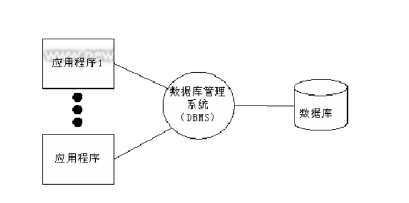
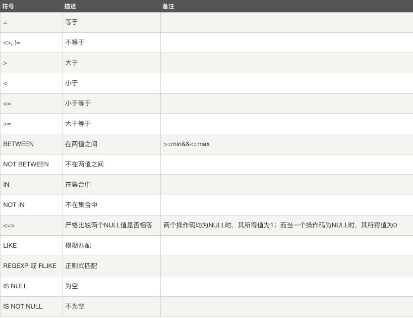
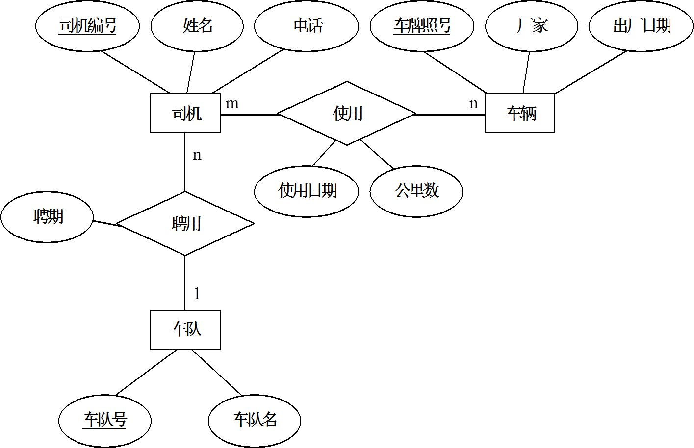

# MySQL数据库


## 数据库概述

### 数据存储阶段 

【1】 人工管理阶段

缺点 ：  数据无法共享,不能单独保持,数据存储量有限

【2】 文件管理阶段 （.txt  .doc  .xls）
    
优点 ： 数据可以长期保存,可以存储大量的数据,使用简单

缺点 ：  数据一致性差,数据查找修改不方便,数据冗余度可能比较大

【3】数据库管理阶段

优点 ： 数据组织结构化降低了冗余度,提高了增删改查的效率,容易扩展,方便程序调用，做自动化处理

缺点 ：需要使用sql 或者 其他特定的语句，相对比较复杂

### 数据库应用

>融机构、游戏网站、购物网站、论坛网站 ... ... 



### 基础概念

>数据 ： 能够输入到计算机中并被识别处理的信息集合

>数据结构 ：研究一个数据集合中数据之间关系的

>数据库 ： 按照数据结构，存储管理数据的仓库。数据库是在数据库管理系统管理和控制下，在一定介质（磁盘、内存（常用于缓存））上的数据集合。

>数据库管理系统 ：管理数据库的软件，用于建立和维护数据库

>数据库系统 ： 由数据库和数据库管理系统，开发工具等组成的集合 

>数据仓库：对数据存储的管理


### 数据库分类和常见数据库

* 关系型数据库和非关系型数据库

>关系型： 采用关系模型（二维表）来组织数据结构的数据库 

>非关系型： 不采用关系模型组织数据结构的数据库

* 开源数据库和非开源数据库

> 开源：MySQL、SQLite、MongoDB

> 非开源：Oracle、DB2、SQL_Server

* 常见的关系型数据库

> MySQL、Oracle、SQL_Server、DB2、SQLite（运维、嵌入式、python标准库支持）  


### 认识关系型数据库和MySQL

1. 数据库结构 （图库结构）

>数据元素 --> 记录 -->数据表 --> 数据库


2. 数据库概念解析

>数据表 ： 存放数据的表格 

>字段： 每个列，用来表示该列数据的含义

>记录： 每个行，表示一组完整的数据


3. MySQL特点

* 是开源数据库，使用C和C++编写 
* 能够工作在众多不同的平台（操作系统）上
* 提供了用于C、C++、Python、Java、Perl、PHP、Ruby众多语言的API
* 存储结构优良，运行速度快
* 功能全面丰富

4. MySQL安装

>Ubuntu安装MySQL服务
>
>>安装服务端: sudo apt-get install mysql-server (安装服务端后会自动安装客户端)
>>安装客户端: sudo apt-get install mysql-client
>>
>>> 配置文件：/etc/mysql  （最主要的配置文件conf.d）
>>> 命令集： /usr/bin
>>> 数据库存储目录 ：/var/lib/mysql

>Windows安装MySQL
>
>>下载MySQL安装包(windows)  https://dev.mysql.com/downloads/mysql/
>>  mysql-installer***5.7.***.msi
>>安装教程去安装

5. 启动和连接MySQL服务

>服务端启动
>
>>查看MySQL状态: sudo /etc/init.d/mysql status
>>启动服务：sudo /etc/init.d/mysql start | stop | restart

>客户端连接
>
>>命令格式 
>>
>>>mysql -h主机地址 -u用户名 -p密码
>>>mysql -hlocalhost -uroot -p123456
>>>本地连接可省略 -h 选项: mysql -uroot -p123456
>>>				     mysql -u root -p 回车 123456 （输入密码过程隐藏）

>关闭连接
>
>> ctrl-D
>> exit


## SQL语句

> 什么是SQL
>
> >结构化查询语言(Structured Query Language)，一种特殊目的的编程语言，是一种数据库查询和程序设计语言，用于存取数据以及查询、更新和管理关系数据库系统。

> SQL语句使用特点
>
> * SQL语言基本上独立于数据库本身
> * 各种不同的数据库对SQL语言的支持与标准存在着细微的不同
> * 每条命令必须以 ; 结尾
> * SQL命令**关键字**不区分字母大小写

## MySQL 数据库操作

### 数据库操作

退出编辑 

>ctrl C 回车

1.查看已有库

>show databases;

>sys 存储操作系统信息
>information_schema 存储的数据信息
>performance_schema 缓存信息
>mysql 存储配置信息

2.创建库(指定字符集)

>create database 库名 [character set utf8];

```sql
e.g. 创建stu数据库，编码为utf8
create database `stu` default character set utf8;
create database stu charset=utf8;
```

3.查看创建库的语句(字符集)

>show create database 库名;

```sql
e.g. 查看stu创建方法
show create database stu;
```

4.查看当前所在库

>select database();

5.切换库

>use 库名;

```sql
e.g. 使用stu数据库
use stu;
```

6.删除库

>drop database 库名;

```sql
e.g. 删除test数据库
drop database test;
```

7.库名的命名规则

>* 数字、字母、下划线,但不能使用纯数字
>* 库名区分字母大小写
>* 不能使用特殊字符和mysql关键字


### 数据表的管理

1. 表结构设计初步

   【1】 分析存储内容
   【2】 确定字段构成
   【3】 设计字段类型

2. 数据类型支持

>数字类型：
>
>>整数类型（精确值） - INTEGER，INT，SMALLINT，TINYINT，MEDIUMINT，BIGINT
>>定点类型（精确值） - DECIMAL
>>浮点类型（近似值） - FLOAT，DOUBLE
>>比特值类型 - BIT


>对于精度比较高的东西，比如money，用decimal类型提高精度减少误差。列的声明语法是DECIMAL(M,D)。
>
>>M是数字的最大位数（精度）。其范围为1～65，M 的默认值是10。
>>D是小数点右侧数字的数目（标度）。其范围是0～30，但不得超过M。
>>比如 DECIMAL(6,2)最多存6位数字，小数点后占2位,取值范围-9999.99到9999.99。

> 比特值类型指0，1值表达2种情况，如真，假

----------------------------------

>字符串类型：
>
>>CHAR和VARCHAR类型
>>BLOB和TEXT类型
>>ENUM类型和SET类型


* char 和 varchar

>char：定长，效率高，一般用于固定长度的表单提交数据存储，默认1字符
>varchar：不定长，效率偏低 ，但是节省空间。

* text 和blob

>text用来存储非二进制文本
>blob用来存储二进制字节串

* enum 和 set

>enum用来存储给出的一个值
>set用来存储给出的值中一个或多个值

-------------------------------------------


1. 表的基本操作

>创建表(指定字符集)
>
>>create table 表名(
>>字段名 数据类型,
>>字段名 数据类型,
>>...
>>字段名 数据类型
>>);

>>* 如果你想设置数字为无符号则加上 unsigned
>>* 如果你不想字段为 NULL 可以设置字段的属性为 NOT NULL， 在操作数据库时如果输入该字段的数据为NULL ，就会报错。
>>* DEFAULT 表示设置一个字段的默认值
>>* AUTO_INCREMENT定义列为自增的属性，一般用于主键，数值会自动加1。
>>* PRIMARY KEY关键字用于定义列为主键。主键的值不能重复。

```sql
e.g.  创建班级表
create table class_1 (id int primary key auto_increment,name varchar(32) not null,age int unsigned not null,sex enum('w','m'),score float default 0.0);

e.g. 创建兴趣班表
create table interest (id int auto_increment,name varchar(32) not null,hobby set('sing','dance','draw'),level char not null,price decimal(6,2),comment text,primary key(id));
```

> 查看数据表
>
> >show tables；

>查看已有表的字符集
>
>>show create table 表名;

>查看表结构
>
>>desc 表名;

>k删除表
>
>>drop table 表名;


## 数据基本操作

### 插入(insert)

```SQL
insert into 表名 values(值1),(值2),...;
insert into 表名(字段1,...) values(值1),...;
```

```sql
e.g. 
insert into class_1 values (2,'Baron',10,'m',91),(3,'Jame',9,'m',90);
```

### 查询(select)

```SQL
select * from 表名 [where 条件];
select 字段1,字段名2 from 表名 [where 条件];
```

```sql
e.g. 
select * from class_1;

select name,age from class_1;

```

### where子句

where子句在sql语句中扮演了重要角色，主要通过一定的运算条件进行数据的筛选

MySQL 主要有以下几种运算符：

>算术运算符
>比较运算符
>逻辑运算符
>位运算符

#### 算数运算符


```sql
e.g.
select * from class_1 where age % 2 = 0;

```


#### 比较运算符



```sql
e.g.
select * from class_1 where age > 8;
select * from class_1 where between 8 and 10;
select * from class_1 where age in (8,9);

```

#### 逻辑运算符


```sql
e.g.
select * from class_1 where sex='m' and age>9;

```

#### 位运算符


### 更新表记录(update)

```SQL
update 表名 set 字段1=值1,字段2=值2,... where 条件;

```

```sql
e.g.
update class_1 set age=11 where name='Abby';

```


###　删除表记录（delete）

```SQL
delete from 表名 where 条件;

注意:delete语句后如果不加where条件,所有记录全部清空

```

```sql
e.g.
delete from class_1 where name='Abby';

```


### 表字段的操作(alter)

```SQL
语法 ：alter table 表名 执行动作;

* 添加字段(add)
    alter table 表名 add 字段名 数据类型;
    alter table 表名 add 字段名 数据类型 first;
    alter table 表名 add 字段名 数据类型 after 字段名;
* 删除字段(drop)
    alter table 表名 drop 字段名;
* 修改数据类型(modify)
    alter table 表名 modify 字段名 新数据类型;
* 修改字段名(change)
    alter table 表名 change 旧字段名 新字段名 新数据类型;
* 表重命名(rename)
    alter table 表名 rename 新表名;

```

```sql
e.g. 
alter table interest add tel char(11) after name;

```


### 时间类型数据

>时间和日期类型:
>
>>DATE，DATETIME和TIMESTAMP类型
>>TIME类型
>>年份类型YEAR


#### 时间格式

> date ："YYYY-MM-DD"
> time ："HH:MM:SS"
> datetime ："YYYY-MM-DD HH:MM:SS"
> timestamp ："YYYY-MM-DD HH:MM:SS"
> 注意
>   1、datetime ：以系统时间存储
>   2、timestamp ：以标准时间存储但是查看时转换为系统时区，所以表现形式和datetime相同


```sql
e.g.
create table marathon (id int primary key auto_increment,athlete varchar(32),birthday date,registration_time datetime,performance time);

```


#### 日期时间函数

  * now()  返回服务器当前时间,格式对应datetime类型
  * curdate() 返回当前日期，格式对应date类型
  * curtime() 返回当前时间，格式对应time类型

#### 时间操作

* 查找操作

```sql
  select * from marathon where birthday>='2000-01-01';
  select * from marathon where birthday>="2000-07-01" and performance<="2:30:00";

```

* 日期时间运算

  - 语法格式

    select * from 表名  where 字段名 运算符 (时间-interval 时间间隔单位);

  - 时间间隔单位：   2 hour | 1 minute | 2 second | 2 year | 3 month |  1 day

```sql
  select * from marathon where registration_time > (now()-interval 7 day);

```

### 高级查询语句


#### 模糊查询和正则查询

LIKE用于在where子句中进行模糊查询，SQL LIKE 子句中使用百分号 %来表示任意0个或多个字符，下划线_表示任意一个字符。

使用 LIKE 子句从数据表中读取数据的通用语法：

```sql
SELECT field1, field2,...fieldN 
FROM table_name
WHERE field1 LIKE condition1

```

```sql
e.g. 
mysql> select * from class_1 where name like 'A%';

```

mysql中对正则表达式的支持有限，只支持部分正则元字符

```sql
SELECT field1, field2,...fieldN 
FROM table_name
WHERE field1 REGEXP condition1

```

```sql
e.g. 
select * from class_1 where name regexp '^B.+';

```

#### 排序

ORDER BY 子句来设定你想按哪个字段哪种方式来进行排序，再返回搜索结果。

使用 ORDER BY 子句将查询数据排序后再返回数据：

```sql
SELECT field1, field2,...fieldN from table_name1 where field1
ORDER BY field1 [ASC [DESC]]

```

默认情况ASC表示升序，DESC表示降序

```sql
select * from class_1 where sex='m' order by age;

```

#### 分页(限制)

LIMIT 子句用于限制由 SELECT 语句返回的数据数量 或者 UPDATE,DELETE语句的操作数量

带有 LIMIT 子句的 SELECT 语句的基本语法如下：

```sql
SELECT column1, column2, columnN 
FROM table_name
WHERE field
LIMIT [num]

```

#### 联合查询

UNION 操作符用于连接两个以上的 SELECT 语句的结果组合到一个结果集合中。多个 SELECT 语句会删除重复的数据。

UNION 操作符语法格式：

```sql
SELECT expression1, expression2, ... expression_n
FROM tables
[WHERE conditions]
UNION [ALL | DISTINCT]
SELECT expression1, expression2, ... expression_n
FROM tables
[WHERE conditions];

```

>expression1, expression2, ... expression_n: 要检索的列。
>tables: 要检索的数据表。
>WHERE conditions: 可选， 检索条件。
>DISTINCT: 可选，删除结果集中重复的数据。默认情况下 UNION 操作符已经删除了重复数据，所以 DISTINCT 修饰符对结果没啥影响。
>ALL: 可选，返回所有结果集，包含重复数据。

```sql
select * from class_1 where sex='m' UNION ALL select * from class_1 where age > 9;

```


### 数据备份

1. 备份命令格式

>mysqldump -u用户名 -p 源库名 > ~/stu.sql
>
>> --all-databases  备份所有库
>> 库名             备份单个库
>> -B 库1 库2 库3   备份多个库
>> 库名 表1 表2 表3 备份指定库的多张表

2. 恢复命令格式

>mysql -uroot -p 目标库名 < stu.sql
>从所有库备份中恢复某一个库(--one-database)
>
>>mysql -uroot -p --one-database 目标库名 < all.sql


## Python操作MySQL数据库

### pymysql安装

>sudo pip3 install pymysql


### pymysql使用流程

1. 建立数据库连接(db = pymysql.connect(...))
2. 创建游标对象(cur = db.cursor())
3. 游标方法: cur.execute("insert ....")
4. 提交到数据库或者获取数据 : db.commit()/db.fetchall()
5. 关闭游标对象 ：cur.close()
6. 断开数据库连接 ：db.close()

#### 常用函数

***参考代码 day15/mysql.py***
***参考代码 day15/read_db.py***
***参考代码 day15/write_db.py***

>db = pymysql.connect(参数列表)
>
>>host ：主机地址,本地 localhost
>>port ：端口号,默认3306
>>user ：用户名
>>password ：密码
>>database ：库
>>charset ：编码方式,推荐使用 utf8

> 数据库连接对象(db)的方法
>
> > cur = db.cursor() 返回游标对象,用于执行具体SQL命令
> > db.commit() 提交到数据库执行
> > db.rollback() 回滚，用于当commit()出错是回复到原来的数据形态
> > db.close() 关闭连接

>游标对象(cur)的方法
>
>>cur.execute(sql命令,[列表]) 执行SQL命令
>>cur.fetchone() 获取查询结果集的第一条数据，查找到返回一个元组否则返回None
>>cur.fetchmany(n) 获取前n条查找到的记录，返回结果为元组嵌套元组， ((记录1),(记录2))。
>>cur.fetchall() 获取所有查找到的记录，返回结果形式同上。
>>cur.close() 关闭游标对象


# MySQL基础回顾


## **1、数据库概念**

**数据库**

- 存储数据的仓库（逻辑概念，并未真实存在）

**数据库软件**

- 真实软件，用来实现数据库这个逻辑概念

**数据仓库**

- 数据量更加庞大，更加侧重数据分析和数据挖掘，供企业决策分析之用，主要是数据查询，修改和删除很少


## **2、MySQL的特点**

- 关系型数据库
- 跨平台
- 支持多种编程语言（python、java、php）
- 基于磁盘存储，数据是以文件形式存放在数据库目录/var/lib/mysql下

## **3、启动连接**

- 服务端启动 

```mysql
sudo /etc/init.d/mysql start|stop|restart|status
sudo service mysql start|stop|restart|status
```

- 客户端连接

```mysql
mysql -hIP地址 -u用户名 -p密码
本地连接可省略 -h 选项
```


## **4、基本SQL命令**

**库管理**

```mysql
    1、查看已有库；
	  show databases;
    2、创建库并指定字符集；
      create database 库名 charset utf8;
    3、查看当前所在库；
	  select database();
    4、切换库；
	  use 库名;
    5、查看库中已有表；
	  show tables;
    6、删除库；
	  drop database 库名;
```

**表管理**

```mysql
    1、创建表并指定字符集；
      create table 表名 (字段名 类型 属性,
                    ...)
                    charset=utf8;
    2、查看创建表的语句 (字符集、存储引擎)；
      show create table 表名;
    3、查看表结构;
      desc 表名;
    4、删除表;
      drop table 表名1,表名2,...;
```

**表记录管理**

```mysql
    1、增 ： 
      insert into 表名 [字段名] values (字段1值,字段2值,...),(字段1值,字段2值,...),...;
    2、删 ： 
      delete from 表名 where 条件;
    3、改 ： 
      update 表名 set 字段名=值 where 条件;
    4、查 ： 
      select 字段名或* from 表名 where 条件;
```

**表字段管理（alter table 表名）**

```mysql
    1、增 ： 
      alter table 表名 add 字段名 类型 first|after ...;
    2、删 ： 
      alter table 表名 drop 字段名;
    3、改 ： 
      alter table 表名 modify 字段名 新类型;
    4、表重命名：
      alter table 表名 rename 新表名;
```


## **5、数据类型**

**四大数据类型**

-  数值类型

```mysql
 tinyint 1 
 smallint 2
 int 4
 bigint 8
 float 
 decimal(全部长度,小数长度)
```

- 字符类型

```mysql
char()  定长
varchar()  变长  预留1-2个字节(3位八进制)的空间用于存储当前字段实际存储的数据长度
text
blob
```

- 枚举类型 

```mysql
enum()
set()

```

- 日期时间类型

```mysql
date
time
datetime
timestamp
year
create_time datetime
update_time datetime

```

**日期时间函数** 

```mysql
now()
curdate()
curtime()
year(字段名)  转化函数

```

**日期时间运算**

```mysql
select * from 表名 where 字段名 运算符(NOW()-interval 间隔);
间隔单位: 1 day | 3 month | 2 year
eg1:查询1年以前的用户充值信息
select * from user_pay where create_time < (now()-interval 1 year)

```

## 6、MySQL运算符

- **数值比较**

```mysql
> >= < <= = !=
eg1 : 查询成绩不及格的学生
  select * from students where score < 60;
eg2 : 删除成绩不及格的学生
  delete from students where score < 60;
eg3 : 把id为3的学生的姓名改为 周芷若
  update students set name='周芷若' where id=3;    

```

- **逻辑比较** 

```mysql
and  or
eg1 : 查询成绩不及格的男生
  select * from students where score < 60 and gender='M';
eg2 : 查询成绩在60-70之间的学生
  select * from students where score >=60 and score <= 70;

```


- **范围内比较** 

```mysql
between 值1 and 值2 、in() 、not in()
eg1 : 查询不及格的学生姓名及成绩
  select name, score from students where score between 0 and 59;
eg2 : 查询AID19和AID18班的学生姓名及成绩
  select name, score from students where class in ('AID19', 'AID18');

```

- **模糊比较（like）**

```mysql
where 字段名 like 表达式(%_)
eg1 : 查询北京的姓赵的学生信息
  select * from students where address='北京' and name like '赵%';

```


- **NULL判断**

```mysql
is NULL 、is not NULL
eg1 : 查询姓名字段值为NULL的学生信息
  select * from students where name is null;

```


## 7、查询

- **order by**

给查询的结果进行排序(永远放在SQL命令的倒数第二的位置写)

```mysql
order by 字段名 ASC/DESC
eg1 : 查询成绩从高到低排列
  select * from students order by score desc;

```

- **limit**

限制显示查询记录的条数（永远放在SQL命令的最后写）

```mysql
limit n ：显示前n条
limit m,n ：从第(m+1)条记录开始，显示n条
分页：每页显示10条，显示第6页的内容
select * from students limit 50, 10     

```

******************************************************************************************

# 

## **MySQL基础巩固**

- **创建库 ：country（指定字符编码为utf8）**

  ```mysql
  create database country charset=utf8;
  
  ```

  **创建表 ：sanguo 字段：id 、name、attack、defense、gender、country**
      **要求 ：id设置为主键,并设置自增长属性**

  ```mysql
  create table sanguo(id int primary key auto_increment,
                     name varchar(20),
                     attack int,
                     defense int,
                     gender char(1),
                     country varchar(20)
                     )charset=utf8;
                     
  desc sanguo \G; 
  
  ```

  

- **插入5条表记录（id 1-5,name-诸葛亮、司马懿、貂蝉、张飞、赵云），攻击>100,防御<100）**

  ```mysql
  insert into sanguo values
  (null,'诸葛亮',170,60,'M','蜀国'),
  (null,'张飞',190,90,'M','蜀国'),
  (null,'赵云',197,82,'M','蜀国'),
  (null,'司马懿',110,55,'M','魏国'),
  (null,'貂蝉',105,30,'F','吴国');
  
  select * from sanguo \G;
  
  ```

  

- **查找所有蜀国人的信息**

  ```mysql
  select * from sanguo where country='蜀国';
  
  ```

- **将赵云的攻击力设置为360,防御力设置为68**

  ```mysql
  update sanguo set attack=360, defense=68 where name='赵云';
  
  ```

- **将吴国英雄中攻击值为105的英雄的攻击值改为100,防御力改为60**

  ```mysql
  update sanguo set attack=100, defense=60 
  where country='吴国';
  
  ```

- **找出攻击值高于200的蜀国英雄的名字、攻击力**

  ```mysql
  select name,attack from sanguo 
  where attack>200 and country='蜀国';
  
  ```

- **将蜀国英雄按攻击值从高到低排序**

  ```mysql
  select * from sanguo 
  where country='蜀国' 
  order by attack desc;
  
  ```

- **魏蜀两国英雄中名字为三个字的按防御值升序排列**

  ```mysql
  select * from sanguo 
  where country in ('蜀国','魏国') and name like "___" 
  order by defense asc;
  
  ```

- **在蜀国英雄中,查找攻击值前3名且名字不为 NULL 的英雄的姓名、攻击值和国家**

  ```mysql
  select name,attack,country from sanguo 
  where country='蜀国' and name is not null 
  order by attack desc
  limit 3;
  
  ```

## MySQL普通查询

```mysql
    3、select ...聚合函数 from 表名
    1、where ...
    2、group by ...
    4、having ...
    5、order by ...
    6、limit ...;

```

- **聚合函数**         针对一组值,返回一个值

| 方法                                      | 功能                 |
| ----------------------------------------- | -------------------- |
| avg(字段名)                               | 该字段的平均值       |
| max(字段名)                               | 该字段的最大值       |
| min(字段名)                               | 该字段的最小值       |
| sum(字段名)                               | 该字段所有记录的和   |
| count(字段名)                             | 统计该字段记录的个数 |
| count(*)可统计所有数据,包括值为null的数据 |                      |

```mysql
select count(age) from user;  # 10条数据有5条age null,返回5
select count(*) from user;  # 返回10

```

eg1 : 找出表中的最大攻击力的值？

```mysql
select max(attack) from sanguo;

```

eg2 : 表中共有多少个英雄？

```mysql
select count(*) as number from sanguo;

```

eg3 : 蜀国英雄中攻击值大于200的英雄的数量

```mysql
select count(id) from sanguo 
where attack>200 and country='蜀国';

```

- **group by**

给查询的结果进行分组
eg1 : 计算每个国家的平均攻击力

```mysql
select country,avg(attack) from sanguo
group by country;

```


eg2 : 所有国家的男英雄中 英雄数量最多的前2名的 国家名称及英雄数量

```mysql
select country,count(name) as number from sanguo
where gender='M'
group by country
order by number desc
limit 2;

```

​	==group by后字段名必须要为select后的字段==
​	==查询字段和group by后字段不一致,则必须对该字段进行聚合处理(聚合函数)==

- **having语句**

对分组聚合后的结果进行进一步筛选

eg1 : 找出平均攻击力大于105的国家的前2名,显示国家名称和平均攻击力

```mysql
select country, avg(attack) as avg_attack from sanguo
group by country
having avg_attack > 105
order by avg_attack desc
limit 2;

```

注意

having语句通常与group by联合使用
having语句存在弥补了where关键字不能与聚合函数联合使用的不足,where只能操作表中实际存在的字段,having操作的是聚合函数生成的显示列


- **distinct语句**

不显示字段重复值


eg1 : 表中都有哪些国家

```mysql
select distinct country from sanguo;

```

eg2 : 计算一共有多少个国家

```mysql
select count(distinct country) from sanguo;

```

注意

distinct和from之间所有字段都相同才会去重
distinct不能对任何字段做聚合处理


- **查询表记录时做数学运算**

运算符 ： +  -  *  /  %  **


eg1: 查询时显示攻击力翻倍

```mysql
select name, attack*2 from sanguo;

```

eg2: 更新蜀国所有英雄攻击力 * 2

```mysql
update sanguo set attack = attack * 2
where country = '蜀国';

```


## 索引概述

- **定义**

对数据库表的一列或多列的值进行排序的一种结构(Btree方式 B树 B-树)

**二叉树**
树的高度没法保证,每个节点左右两个叉

**B树**
1、所有的查询均要从根节点往下查找
2、每个节点是多叉的,且每个节点里既存储了ID又存储了对应的具体数据,故整体树的高度未达到最优

**B+树**
1、非叶子节点只存储了索引ID不存储数据,故单个节点可存储的索引ID比B树多,从而等量数据的B+数会比B树矮(胖)
2、所有数据均在叶子节点,并且是有序相连的,故根据索引ID做范围查询时速度更快 [where id>5 and id<20]


- **优点**

加快数据检索速度

- **缺点**

占用物理存储空间(/var/lib/mysql)
当对表中数据更新时,索引需要动态维护,降低数据维护速度


- **索引示例**

```mysql
# cursor.executemany(SQL,[data1,data2,data3])
# 以此IO执行多条表记录操作，效率高，节省资源
1、开启运行时间检测
  mysql>show variables like '%pro%';
  mysql>set profiling=1;  # 响应时间检测
2、执行查询语句(无索引)
  select name from student where name='Tom99999';
3、查看执行时间
  show profiles;
4、在name字段创建索引  只能通过该字段查找
  create index name on student(name);
5、再执行查询语句
  select name from student where name='Tom88888';
6、查看执行时间
  show profiles;
```

## 索引分类

#### 普通(MUL)  and 唯一(UNI)

- **使用规则**

1、可设置多个字段
2、普通索引 ：字段值无约束,KEY标志为 MUL
3、唯一索引(unique) ：字段值不允许重复,但可为 NULL
                    KEY标志为 UNI
4、哪些字段创建索引:经常用来查询的字段、where条件判断字段、order by排序字段


- **创建普通索引and唯一索引**

创建表时

```mysql
create table 表名(
字段名 数据类型,
字段名 数据类型,
index(字段名),
index(字段名),
unique(字段名)
);

```

已有表中创建

```mysql
create [unique] index 索引名 on 表名(字段名);

```

- **查看索引**

```mysql
1、desc 表名;  --> KEY标志为：MUL 、UNI
2、show index from 表名 \G;

```

- **删除索引**

```mysql
drop index 索引名 on 表名;

```

#### **主键(PRI)and自增长(auto_increment)**

- **使用规则**

```mysql
1、只能有一个主键字段
2、所带约束 ：不允许重复,且不能为NULL
3、KEY标志(primary) ：PRI
4、通常设置记录编号字段id,能唯一锁定一条记录

```

- **创建**

创建表添加主键

```mysql
create table student(
id int auto_increment,
name varchar(20),
primary key(id)
)charset=utf8,auto_increment=10000;  #设置自增长起始值

```

已有表添加主键

```mysql
alter table 表名 add primary key(id);

```

已有表操作自增长属性	

```mysql
1、已有表添加自增长属性
  alter table 表名 modify id int auto_increment;
2、已有表重新指定起始值：
  alter table 表名 auto_increment=20000;

```

- **删除**

```mysql
1、删除自增长属性(modify)
  alter table 表名 modify id int;
2、删除主键索引
  alter table 表名 drop primary key;

```

## **外键（foreign key）**

- **定义**

  让当前表字段的值在另一个表的范围内选择

- **语法**

  ```mysql
  foreign key(参考字段名 stu_id)
  references 主表(被参考字段名 id)
  on delete 级联动作
  on update 级联动作
  ```

- **使用规则**

1、主表、从表字段数据类型要一致
2、主表被参考字段 ：KEY的一种，一般为主键

- **示例**

表1、缴费信息表(财务)                                主表

```mysql
id   姓名     班级     缴费金额
1   唐伯虎   AID19     300
2   点秋香   AID19     300
3   祝枝山   AID19     300
```

```mqsql
create database db2 charset=utf8;
use db2;
create table master(
id int primary key auto_increment,
name varchar(20),
class char(5),
money decimal(6,2)
)charset=utf8;
insert into master values
(1, '唐伯虎','AID19',300),
(2,'点秋香','AID19',300),
(3,'祝枝山','AID19',300);
```

表2、学生信息表(班主任) -- 做外键关联           从表

```mysql
stu_id   姓名   缴费金额
  1     唐伯虎    300
  2     点秋香    300
```

```mysql
create table slave(
stu_id int,
name varchar (20),
money decimal (6,2),
foreign key (stu_id) 
references master(id)
on delete cascade 
on update cascade 
)charset=utf8;
insert into slave values 
(1, '唐伯虎',300),
(2,'点秋香',300),
(3,'祝枝山',300);

create table slave_2(
stu_id int,
name varchar (20),
money decimal (6,2),
foreign key (stu_id) 
references master(id)
)charset=utf8;
insert into slave_2 values 
(2,'点秋香',300),
(8,'祝枝山',300);

create table slave_3(
stu_id int,
name varchar (20),
money decimal (6,2),
foreign key (stu_id) 
references master(id)
on delete set null
on update set null
)charset=utf8;
insert into slave_3 values 
(2,'点秋香',300),
(8,'祝枝山',300);
```


- **删除外键**

```mysql
alter table 表名 drop foreign key 外键名;  # rename
​外键名 ：show create table 表名;
```

- **级联动作**

```mysql
cascade
​数据级联删除、更新(参考字段)
restrict(默认)
​从表有相关联记录,不允许主表操作
set null
​主表删除、更新,从表相关联记录字段值为NULL
```

- **已有表添加外键**

```mysql
alter table 表名 add foreign key(参考字段) references 主表(被参考字段) on delete 级联动作 on update 级联动作
```


## 嵌套查询(子查询)

定义

把内层的查询结果作为外层的查询条件

语法格式

```mysql
select ... from 表名 where 条件(select ....);
```

示例


1、把攻击值小于平均攻击值的英雄名字和攻击值显示出来

```mysql
select name,attack from sanguo where attack<
(select avg(attack) from sanguo);
```

2、找出每个国家攻击力最高的英雄的名字和攻击值(子查询)

```mysql
select name, attack from sanguo 
where (country, attack) in
(select country, max(attack) from sanguo group by country);

select max(attack) from sanguo 
where (country,attack) in((蜀国,360),(蜀国,110),(吴国,100));
```

## **多表查询**

**sql脚本资料：join_query.sql**

```mysql
mysql -uroot -p123456
mysql>use db2;
mysql>source /home/tarena/join_query.sql
```

```mysql
create table if not exists province(
id int primary key auto_increment,
pid int,
pname varchar(15)
)default charset=utf8;

insert into province values
(1, 130000, '河北省'),
(2, 140000, '陕西省'),
(3, 150000, '四川省'),
(4, 160000, '广东省'),
(5, 170000, '山东省'),
(6, 180000, '湖北省'),
(7, 190000, '河南省'),
(8, 200000, '海南省'),
(9, 200001, '云南省'),
(10,200002,'山西省');

create table if not exists city(
id int primary key auto_increment,
cid int,
cname varchar(15),
cp_id int
)default charset=utf8;

insert into city values
(1, 131100, '石家庄市', 130000),
(2, 131101, '沧州市', 130000),
(3, 131102, '廊坊市', 130000),
(4, 131103, '西安市', 140000),
(5, 131104, '成都市', 150000),
(6, 131105, '重庆市', 150000),
(7, 131106, '广州市', 160000),
(8, 131107, '济南市', 170000),
(9, 131108, '武汉市', 180000),
(10,131109, '郑州市', 190000),
(11,131110, '北京市', 320000),
(12,131111, '天津市', 320000),
(13,131112, '上海市', 320000),
(14,131113, '哈尔滨', 320001),
(15,131114, '雄安新区', 320002);

create table if not exists county(
id int primary key auto_increment,
coid int,
coname varchar(15),
copid int
)default charset=utf8;

insert into county values
(1, 132100, '正定县', 131100),
(2, 132102, '浦东新区', 131112),
(3, 132103, '武昌区', 131108),
(4, 132104, '哈哈', 131115),
(5, 132105, '安新县', 131114),
(6, 132106, '容城县', 131114),
(7, 132107, '雄县', 131114),
(8, 132108, '嘎嘎', 131115);
```

- **笛卡尔积**

```mysql
select 字段名列表 from 表名列表; 
```

```mysql
create table tt(tt1 varchar(5));
create table tt2(tt2 varchar(5));
insert into tt1 values('a','b','c','d');
insert into tt2 values('w','x','y','z');
select tt1.tt1, tt2.tt2 from tt1, tt2;
```

- **多表查询**

```mysql
select 字段名列表 from 表名列表 where 条件;
```

- **示例**

1、显示省和市的详细信息
   河北省  石家庄市
   河北省  廊坊市
   湖北省  武汉市

```mysql
select province.pname,city.cname from province,city
where city.cp_id=province.pid;
```

2、显示 省 市 县 详细信息

```mysql
select province.pname,city.cname,county.coname from province,city,county
where city.cp_id=province.pid and county.copid=city.cid;
```

## 连接查询

- **内连接（结果同多表查询，显示匹配到的记录）**

````mysql
select 字段名 from  表1 
inner join 表2 on 条件 
inner join 表3 on 条件; 
````

eg1 : 显示省市详细信息

```mysql
select province.pname, city.cname from province 
inner join city on city.cp_id=province.pid;
```

eg2 : 显示 省 市 县 详细信息

```mysql
select province.pname,city.cname,county.coname from province 
inner join city on city.cp_id=province.pid 
inner join county on county.copid=city.cid;
```

- **左外连接**

以 左表 为主显示查询结果

```mysql
select 字段名 from 表1 
left join 表2 on 条件 
left join 表3 on 条件;
```

eg1 : 显示 省 市 详细信息（要求省全部显示）

```mysql
select province.pname, city.cname from province 
left join city on city.cp_id=province.pid;
```

- **右外连接**

用法同左连接,以右表为主显示查询结果

```mysql
select 字段名 from 表1 
right join 表2 on 条件 
right join 表3 on 条件;
```

```mysql
select province.pname, city.cname from province 
right join city on city.cp_id=province.pid;
```

## **数据导入**

==掌握大体步骤==

==source 文件名.sql==

**作用**

把文件系统的内容导入到数据库中
**语法（方式一）**

load data infile "文件名"
into table 表名
fields terminated by "分隔符"
lines terminated by "\n"
**示例**
scoretable.csv文件导入到数据库db2的表

```mysql
1、将scoretable.csv放到数据库搜索路径中
   mysql>show variables like 'secure_file_priv';
         /var/lib/mysql-files/
   Linux: sudo cp /home/tarena/scoreTable.csv /var/lib/mysql-files/
2、在数据库中创建对应的表
  create table scoretab(
  rank int,
  name varchar(20),
  score float(5,2),
  phone char(11),
  class char(7)
  )charset=utf8;
3、执行数据导入语句
load data infile '/var/lib/mysql-files/scoreTable.csv'
into table scoretab
fields terminated by ','
lines terminated by '\n'
4、练习
  添加id字段,要求主键自增长,显示宽度为3,位数不够用0填充
alter table scoretab add id int(3) zerofill primary key auto_increment first;
```

**语法（方式二）**

source 文件名.sql

## **数据导出**

**作用**

将数据库中表的记录保存到系统文件里,/var/lib/mysql-files/

**语法格式**

```mysql
select ... from 表名
into outfile "文件名"
fields terminated by "分隔符"
lines terminated by "分隔符";
```

**练习**

1、把sanguo表中英雄的姓名、攻击值和国家三个字段导出来,放到 sanguo.csv中

```mysql
select name,attack,country from country.sanguo
into outfile '/var/lib/mysql-files/sanguo.csv'
fields terminated by ','
lines terminated by '\n';
# 只能该目录/var/lib/mysql-files/
```

2、将mysql库下的user表中的 user、host两个字段的值导出到 user2.txt，将其存放在数据库目录下

```mysql
select user, host from mysql.user
into outfile '/var/lib/mysql-files/user.csv'
fields terminated by ','
lines terminated by '\n';
```

**注意**

1、导出的内容由SQL查询语句决定
2、执行导出命令时路径必须指定在对应的数据库目录 /var/lib/mysql-files/


## **表的复制**

==1、表能根据实际需求复制数据==

==2、复制表时不会把KEY属性复制过来==

**语法**

```mysql
create table 表名 select 查询命令;
```

**练习**

1、复制sanguo表的全部记录和字段,sanguo2

```mysql
create table sanguo2 select * from country.sanguo;
```

2、复制sanguo表的 id,name,country 三个字段的前3条记录,sanguo4

```mysql
create table sanguo4 
select id, name, country from country.sanguo 
order by id 
limit 3; 
```


**注意**

复制表的时候不会把原有表的 KEY 属性复制过来,需要

**复制表结构**
create table 表名 select 查询命令 where false;

```mysql
create table student3 select * from student where false;
```


## **锁（自动加锁和释放锁）**

==全程重点，理论和锁分类及特点==

**目的**

解决客户端并发访问的冲突问题

**锁类型分类**

```
读锁(共享锁)：select 加读锁之后别人不能更改表记录,但可以进行查询
写锁(互斥锁、排他锁)：加写锁之后别人不能查、不能改
```

**锁粒度分类**

表级锁 ：myisam
行级锁 ：innodb

## **存储引擎**

**定义**

```mysql
处理表的处理器
```

**基本操作**

```mysql
1、查看所有存储引擎
   mysql> show engines;
2、查看已有表的存储引擎
   mysql> show create table 表名;
3、创建表指定
   create table 表名(...)engine=MyISAM,charset=utf8,auto_increment=10000;
4、已有表指定
   alter table 表名 engine=InnoDB;
```

**==常用存储引擎及特点==**

```mysql
Linux: 	sudo su
		/var/lib/mysql
```

- InnoDB        聚簇索引

1、支持行级锁
2、支持外键、事务、事务回滚
3、表字段和索引同存储在一个文件中
    表名.frm ：表结构
    表名.ibd : 表记录及索引文件    


- MyISAM        非聚簇索引

1、支持表级锁
2、表字段和索引分开存储
    表名.frm ：表结构
    表名.MYI : 索引文件(my index)
    表名.MYD : 表记录(my data)

- MEMORY  内存 基于hash临时表

1、表记录存储在内存中，效率高
2、服务或主机重启，表记录清除

```mysql
create table memoryt(
id int
)engine=MEMORY;
insert into memoryt values(1),(2);
```

```shell
linux: sudo /etc/init.d/mysql restart
```

**如何选择存储引擎**

1、执行查操作多的表用 MyISAM
2、执行写操作多的表用 InnoDB
3、临时表 ： MEMORY
4、具体问题具体分析 -- 具体到数据表结构,数量级:更新/查询/插入

```mysql
create table myi(
id int
)engine=MyISAM;
```

**mvcc 多版本控制协议**

InnoDB锁机制,包含该机制
数据行中预留一个version字段 该字段在数据更新是时 +1
当执行有version字段的数据更新时,需要查询一下起初select获取的该数据行的version是否改变,若改变,则放弃此次更新[证明在执行更新操作之前,已经有其他客户端进行了该行数据的更新],后续可重复执行若干次相同的更新方式,若多次执行失败,可考虑更改方案


## **MySQL的用户账户管理**

**开启MySQL远程连接**

```mysql
更改配置文件，重启服务！
1、sudo su
2、cd /etc/mysql/mysql.conf.d
3、cp mysqld.cnf mysqld.cnf.bak  # 文件备份
4、vi mysqld.cnf #找到43行左右,加 # 注释
   # bind-address = 127.0.0.1  # 默认为0.0.0.0,使得能够监听所有的IP
5、保存退出
6、service mysql restart

vi使用 : 按i ->编辑文件 ->ESC ->shift+: ->wq
```

**添加授权用户**

```mysql
1、用root用户登录mysql
   mysql -uroot -p123456
2、授权
   grant 权限列表 on 库.表 to "用户名"@"地址" identified by "密码" 
3、刷新权限
   flush privileges;
4、查询软件重启语句
   ps aux|grep 'mysqld'
```

**授权关键字**

```
all privileges,all ,select,insert ... ... 
库.表 ： *.* 代表所有库的所有表   ex: db2.*
地址： localhost 或者 具体ip 或者 % 
	  当地址 用 % 代表可以用任何地址进入mysql
```

**示例**

1、添加授权用户work,密码123,对所有库的所有表有所有权限

```mysql
grant all privileges on *.* to 'work'@'%' identified by '123';
grant all privileges on *.* to 'work'@'%' identified by '123'　with grant option;  # 与root权限一致
flush privileges;  # 将当前mysql.user中的数据加载到内存中 供mysql服务进行权限检查
select user, host from mysql.user;  #全局的权限查看
select * from mysql.db;  # 各表详细权限的查看
```

2、添加用户duty,对db2库中所有表有所有权限

```mysql
grant all privileges on db2.* to 'duty'@'%' identified by '123456'
```

```mysql
grant select, update on country.* to 'work3'@'%' identified by '123456';  # root权限下操作
flush privileges;
```

mysql.user --显示全部的mysql用户,该表显示的具体权限只针对全局用户有效［全局用户指对当前mysql中所有库及所有表都有相应权限的用户］ #全局的权限查看

mysql.db --显示只有对特定db有操作权限的用户[grant时被指定数据库的用户]  # 各表详细权限的查看

当mysql服务接到mysql语句的时候,权限排查过程:mysql.user->mysql.db

## **事务和事务回滚**

**事务定义**

 一件事从开始发生到结束的过程

**作用**

确保数据的一致性、准确性、有效性

**事务操作**

```mysql
1、开启事务
   mysql>begin; # 方法1
   mysql>start transaction; # 方法2
2、开始执行事务中的1条或者n条SQL命令
3、终止事务
   mysql>commit; # 事务中SQL命令都执行成功,提交到数据库,结束!
   mysql>rollback; # 有SQL命令执行失败,回滚到初始状态,结束!
```

**事务四大特性（ACID）**

- **1、原子性（atomicity）**

一个事务必须视为一个不可分割的最小工作单元，整个事务中的所有操作要么全部提交成功，要么全部失败回滚，对于一个事务来说，不可能只执行其中的一部分操作

- **2、一致性（consistency）**

数据库总是从一个一致性的状态转换到另一个一致性的状态

- **3、隔离性（isolation）**

一个事务所做的修改在最终提交以前，对其他事务是不可见的

- **4、持久性（durability）**

一旦事务提交，则其所做的修改就会永久保存到数据库中。此时即使系统崩溃，修改的数据也不会丢失

**注意**

1、事务只针对于表记录操作(增删改)有效,对于库和表的操作无效
2、事务一旦提交结束，对数据库中数据的更改是永久性的

## **E-R模型(Entry-Relationship)**

**定义**		

E-R模型即 实体-关系 数据模型,用于数据库设计
用简单的图(E-R图)反映了现实世界中存在的事物或数据以及他们之间的关系

**实体、属性、关系**

- 实体

1、描述客观事物的概念
2、表示方法 ：矩形框
3、示例 ：一个人、一本书、一杯咖啡、一个学生

- 属性

1、实体具有的某种特性
2、表示方法 ：椭圆形
3、示例
   学生属性 ：学号、姓名、年龄、性别、专业 ... 
   感受属性 ：悲伤、喜悦、刺激、愤怒 ...

- ==关系（重要）==

1、实体之间的联系
2、一对一关联(1:1) ：老公对老婆
   A中的一个实体,B中只能有一个实体与其发生关联
   B中的一个实体,A中只能有一个实体与其发生关联
3、一对多关联(1:n) ：父亲对孩子
   A中的一个实体,B中有多个实体与其发生关联
   B中的一个实体,A中只能有一个与其发生关联
4、多对多关联(m:n) ：兄弟姐妹对兄弟姐妹、学生对课程
   A中的一个实体,B中有多个实体与其发生关联
   B中的一个实体,A中有多个实体与其发生关联

**ER图的绘制**

矩形框代表实体,菱形框代表关系,椭圆形代表属性



- 课堂示例（老师研究课题）

```mysql
1、实体 ：教师、课题
2、属性
   教师 ：教师代码、姓名、职称
   课题 ：课题号、课题名
3、关系
   多对多（m:n)
   # 一个老师可以选择多个课题，一个课题也可以被多个老师选
```


- 练习

设计一个学生选课系统的E-R图

```mysql
1、实体：学生、课程、老师
2、属性
3、关系
   学生 选择 课程 (m:n)
   课程 任课 老师 (1:n)
```

**关系映射实现（重要）**

```mysql
1:1实现 --> 主外键关联,外键字段添加唯一索引
  表t1 : id int primary key,
          1
  表t2 : t2_id int unique,
         foreign key(t2_id) references t1(id)
          1
1:n实现 --> 主外键关联
  表t1 : id int primary key,
         1
  表t2 : t2_id int,
         foreign key(t2_id) references t1(id)
         1
         1        
m:n实现(借助中间表):
   t1 : t1_id 
   t2 : t2_id 
```

**==多对多实现==**

- 老师研究课题

表1、老师表

```mysql
create table teacher(id int primary key,
                    tname varchar(10),
                    level varchar(10)
                    )charset=utf8;
insert into teacher values
(1, '郭小闹', 'good'),
(2, '王老师', 'goodgood');
```

表2、课题表

```mysql
create table course(id int primary key,
                    cname varchar(10)
)charset=utf8;
insert into course values
(1,'python1'),
(2,'python2'),
(3,'python3'),
(4,'python4');
```

问题？如何实现老师和课程之间的多对多映射关系？
中间表：

```mysql
create table middle (id int primary key,
tid int,
cid int,                     
foreign key(tid) references teacher(id),
foreign key(cid) references course(id)
)charset=utf8;
insert into middle values
(1,1,1),
(2,1,2),
(3,1,4),
(4,2,1),
(5,2,3),
(6,2,4);
```


- 后续

  1、每个老师都在研究什么课题？

```mysql
select teacher.tname,course.cname from teacher
inner join middle on teacher.id=middle.tid 
inner join course on course.id=middle.cid;
```

2、郭小闹在研究什么课题？

```mysql
select course.cname from teacher
inner join middle on teacher.id=middle.tid 
inner join course on course.id=middle.cid
where teacher.tname='郭小闹';
```

## **MySQL调优**

**存储引擎优化**

1、读操作多：MyISAM
2、写操作多：InnoDB


**索引优化**

```
在 select、where、order by 常涉及到的字段建立索引
```

**SQL语句优化**

```mysql
1、单条查询最后添加 LIMIT 1，停止全表扫描
2、where子句中不使用 != ,否则放弃索引全表扫描
3、尽量避免 NULL 值判断,否则放弃索引全表扫描
   优化前：select number from t1 where number is null;
   优化后：select number from t1 where number=0;
   # 在number列上设置默认值0,确保number列无NULL值
4、尽量避免 or 连接条件,否则放弃索引全表扫描
   优化前：select id from t1 where id=10 or id=20;
   优化后： select id from t1 where id=10 union all 
           select id from t1 where id=20;
5、模糊查询尽量避免使用前置 % ,否则全表扫描
   select name from t1 where name like "c%";
6、尽量避免使用 in 和 not in,否则全表扫描
   优化前：select id from t1 where id in(1,2,3,4);
   优化后：select id from t1 where id between 1 and 4;
7、尽量避免使用 select * ...;用具体字段代替 * ,不要返回用不到的任何字段
```


